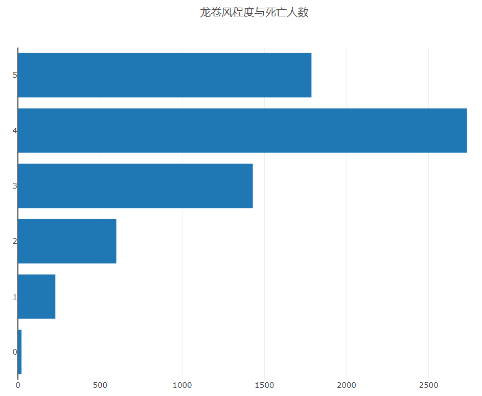
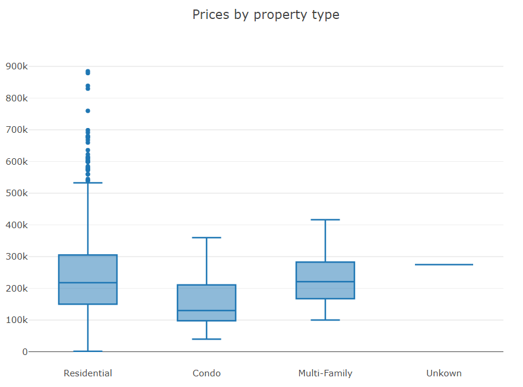
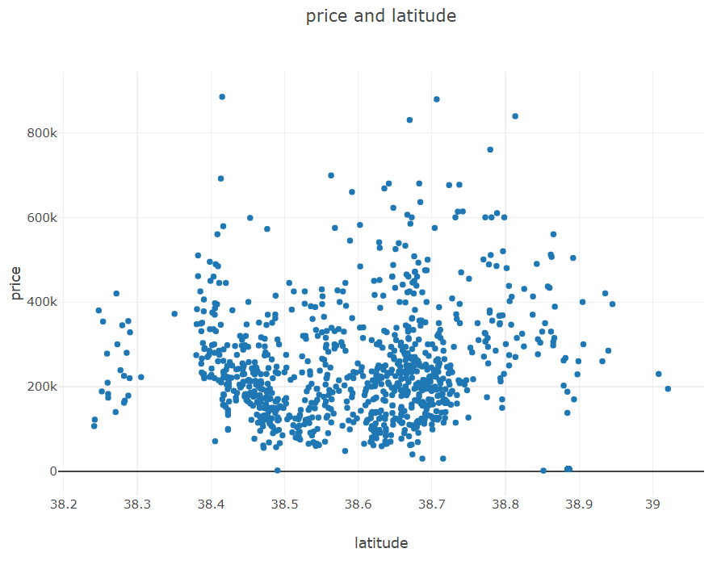
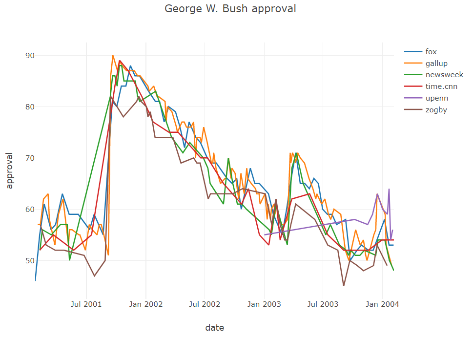
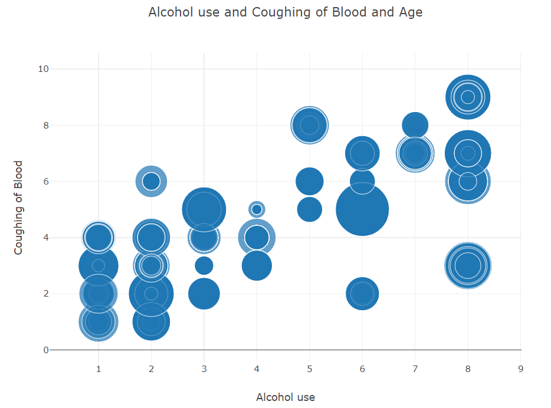
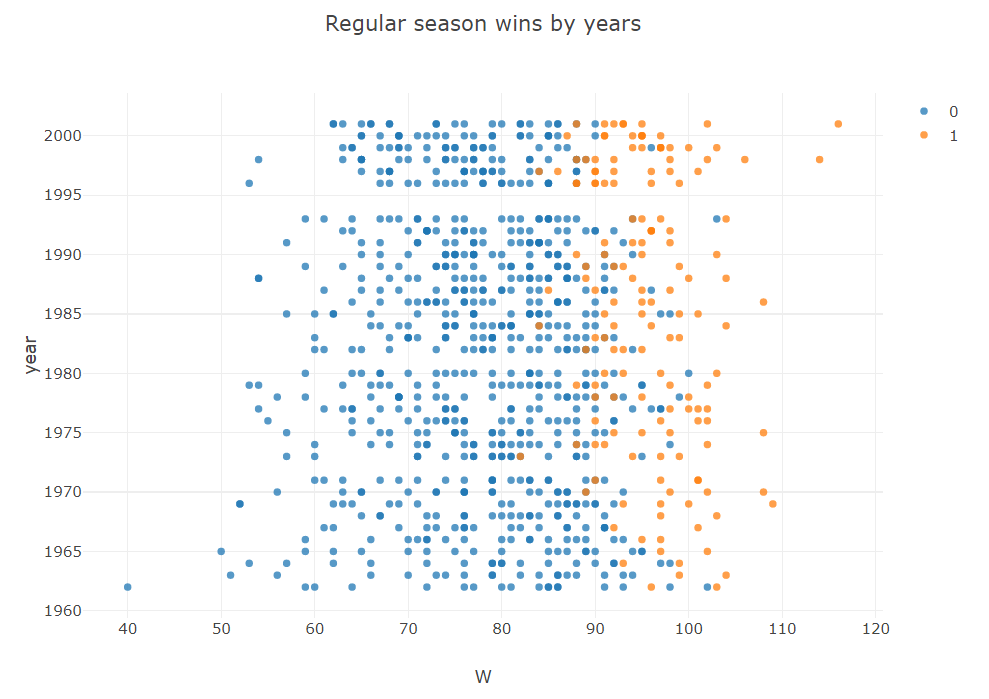
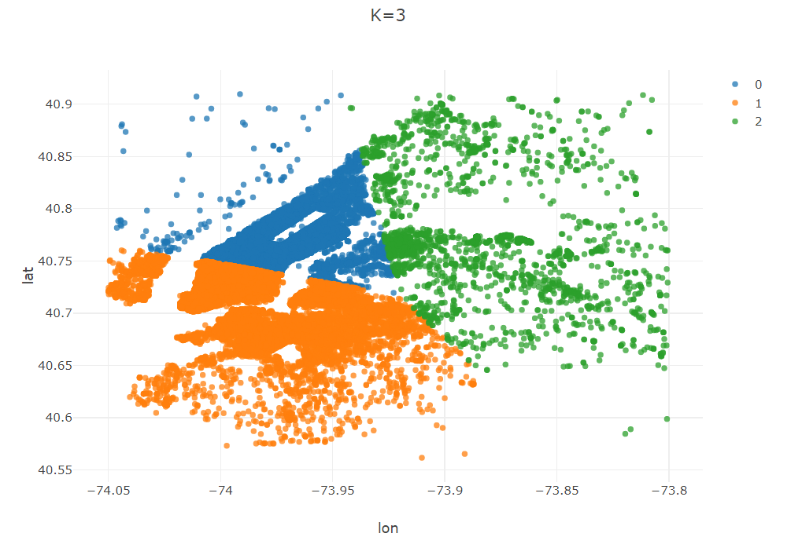

# Tablesaw-zn-study
Java可视化工具tablesaw中文学习

<a href="https://github.com/jtablesaw/tablesaw">Tablesaw项目原地址</a>

<a href="https://jtablesaw.github.io/tablesaw/userguide/toc">Tablesaw官方文档</a>

## 大致目录
#### 1. <a href="https://github.com/2043393364/Tablesaw-zn-study/blob/main/doc/tablesaw-1-introduction.md">Tablesaw相关介绍及使用的准备工作</a>
#### 2. <a href="https://github.com/2043393364/Tablesaw-zn-study/blob/main/doc/tablesaw-2-operationAboutData.md">Tablesaw的数据简单操作</a>
#### 3. <a href="https://github.com/2043393364/Tablesaw-zn-study/blob/main/doc/tablesaw-3-transformingData.md">Tablesaw的数据处理</a>
#### 4. <a href="https://github.com/2043393364/Tablesaw-zn-study/blob/main/doc/tablesaw-4-Plotting%20and%20Visualization.md">Tablesaw的数据可视化绘图</a>
#### 5. <a href="https://github.com/2043393364/Tablesaw-zn-study/blob/main/doc/tablesaw-5-DataScience.md">Tablesaw在数据科学上结合Smile的使用

## 可视化展示

