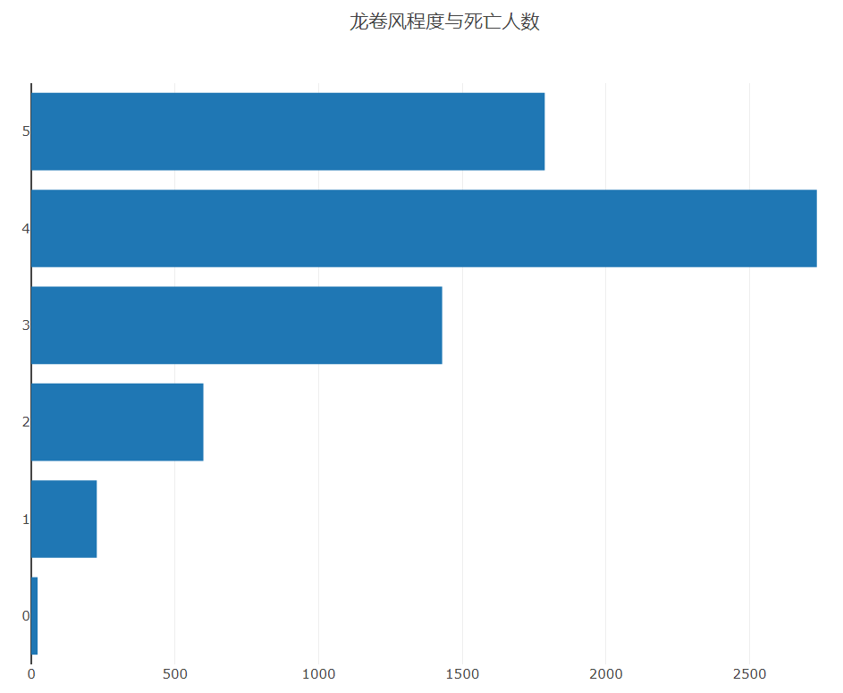
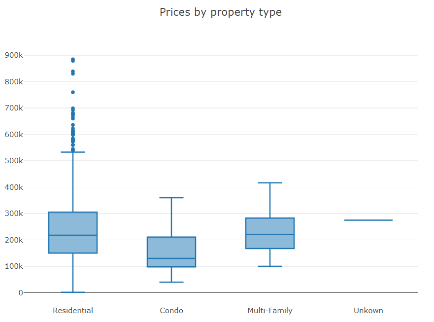
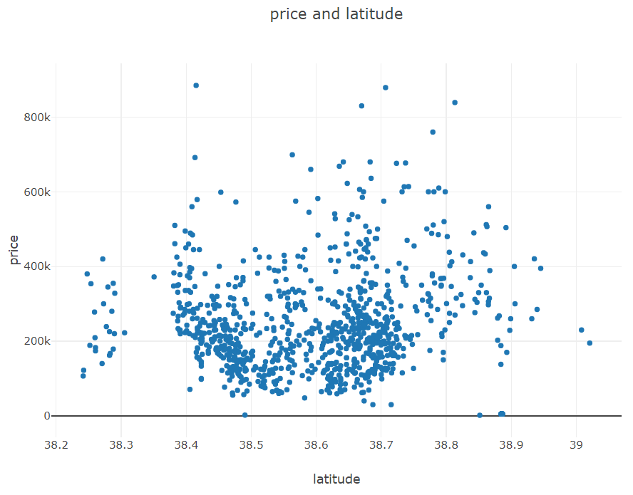

# 绘图与可视化
Tablesaw已经支持多种绘图，包括时间序列图、直方图、二维直方图、箱形图、折线图、面积图、散点图、3D散点图、气泡图、帕累托图、饼图和条形图等等。

> Tablesaw 的图形可视化大多数都是通过调用*Plot.show(Figure figure)* 方法来实现的。
> - figure: 各类图标的实例化对象，若绘制圆饼图，则传递圆饼图的实例化对象

示例
```java
Plot.show(
    HorizontalBarPlot.create()
)
```
> 该代码就是绘制一个横向的直方图(参数未传全)

## 1. 横向直方图

> HorizontaBarPlot.create(String title, Table table, String groupColName, String numberColName) 
> - *title*: 图标标题
> - *table*: 需要绘制的数据表
> - *groupColName*：直方图的组类列名 --- 从table表中获取
> - *NumberColName*：直方图的数据列名 --- 从table表中获取

```java
import org.junit.Test;
import tech.tablesaw.api.IntColumn;
import tech.tablesaw.api.Table;
import tech.tablesaw.columns.Column;
import tech.tablesaw.columns.numbers.IntColumnType;
import tech.tablesaw.plotly.Plot;
import tech.tablesaw.plotly.api.HorizontalBarPlot;

import static tech.tablesaw.aggregate.AggregateFunctions.sum;

/**
 * ClassName: PlotTest
 * Package: PACKAGE_NAME
 * Description:
 *
 * @Author: Ning
 * @Create: 2023/1/2 - 11:36
 */
public class PlotTest {

    @Test
    public void barPlot(){
        // 1. 获取数据集
        Table tornadoes = Table.read().csv("src/test/resources/tornadoes_1950-2014.csv");
        System.out.println(tornadoes.shape());

        // 2. 获取scale列
        IntColumn scale = tornadoes.intColumn("scale");
//        System.out.println(scale.print());

        // 3. 在该列中，将值为-9的值设置为缺失值
        scale.set(scale.isEqualTo(-9), IntColumnType.missingValueIndicator());
//        System.out.println(scale.print());

        // 4. 安装scale进行分组，并对每个组求死亡人数之和
        Table fatalities1 = tornadoes.summarize("fatalities", sum).by("scale");
        System.out.println(fatalities1.print());

        // 5. 绘制横向直方图
        Plot.show(
                HorizontalBarPlot.create(
                        "fatalities by scale", // title
                        fatalities1, // 一个table表
                        "Scale",// 标签名
                        "Sum [Fatalities]" // 数值
                )
        );
    }
}
```

注意：
```java
        fatalities1表
        
Scale  |  Sum [Fatalities]  |
------------------------------
     3  |              1430  |
     1  |               228  |
     2  |               599  |
     4  |              2734  |
     0  |                22  |
        |                 2  |
     5  |              1787  |
```



## 2. 自定义条形图

包括其它的自定义绘图方法一样，在绘制图表前需要先有个画板 *Layout*,然后根据具体图表的内容进行描绘。绘制直方图需要*BarTrace* 对象。
```java
// 创建一个画板对象，并设置图表标题
Layout layout = Layout.builder().title("图表标题").build();

// 创建BarTrace对象，categoricalColumn是table表中类别名所在列，numberColumn则是数据内容
BarTrace trace = BarTrace.bulider(table.categoricalColumn, table.numberColumn).build();

// 绘图
Plot.show(new Figure(layout, trace));
```

示例
```java
import org.junit.Test;
import tech.tablesaw.aggregate.Summarizer;
import tech.tablesaw.api.IntColumn;
import tech.tablesaw.api.Row;
import tech.tablesaw.api.Table;
import tech.tablesaw.columns.Column;
import tech.tablesaw.columns.numbers.IntColumnType;
import tech.tablesaw.plotly.Plot;
import tech.tablesaw.plotly.api.HorizontalBarPlot;
import tech.tablesaw.plotly.api.PiePlot;
import tech.tablesaw.plotly.components.Figure;
import tech.tablesaw.plotly.components.Layout;
import tech.tablesaw.plotly.traces.BarTrace;


import static tech.tablesaw.aggregate.AggregateFunctions.mean;
import static tech.tablesaw.aggregate.AggregateFunctions.sum;

/**
 * ClassName: PlotTest
 * Package: PACKAGE_NAME
 * Description:
 *
 * @Author: Ning
 * @Create: 2023/1/2 - 11:36
 */
public class PlotTest {

    @Test
    public void horizontalBarPlot(){
        // 1. 获取数据集
        Table tornadoes = Table.read().csv("src/test/resources/tornadoes_1950-2014.csv");
        System.out.println(tornadoes.shape());

        // 2. 获取scale列
        IntColumn scale = tornadoes.intColumn("scale");
//        System.out.println(scale.print());

        // 3. 在该列中，将值为-9的值设置为缺失值
        scale.set(scale.isEqualTo(-9), IntColumnType.missingValueIndicator());
//        System.out.println(scale.print());
        
        // 4. 根据State进行分组对fatalities进行求和
        Table t2 = tornadoes.summarize("fatalities", sum).by("State");
        // 排序
        t2 = t2.sortDescendingOn(t2.column(1).name());
        // 5. 创建画板对象并添加标题
        Layout layout = Layout.builder().title("Tornado Fatalities by State").build();
        // 6. 创建真方条对象
        BarTrace trace = BarTrace.builder(t2.categoricalColumn(0), t2.numberColumn(1)).build();
        // 绘制图表
        Plot.show(new Figure(layout, trace));
    }
}

```


## 3. 圆饼图
圆饼图的绘制方法与横向直方图的绘制方法基本一致。
> *PiePlot.create(title, table, groupColName, numberColName)*
> - *title*: 图表标题
> - *table*：需要绘制的数据表
> - *groupColName*：分类标签所在列的列名
> - *NumberColName*：数据所在列的列名

示例
```java
import org.junit.Test;
import tech.tablesaw.aggregate.Summarizer;
import tech.tablesaw.api.IntColumn;
import tech.tablesaw.api.Row;
import tech.tablesaw.api.Table;
import tech.tablesaw.columns.Column;
import tech.tablesaw.columns.numbers.IntColumnType;
import tech.tablesaw.plotly.Plot;
import tech.tablesaw.plotly.api.HorizontalBarPlot;
import tech.tablesaw.plotly.api.PiePlot;
import tech.tablesaw.plotly.components.Figure;
import tech.tablesaw.plotly.components.Layout;
import tech.tablesaw.plotly.traces.BarTrace;


import static tech.tablesaw.aggregate.AggregateFunctions.mean;
import static tech.tablesaw.aggregate.AggregateFunctions.sum;

/**
 * ClassName: PlotTest
 * Package: PACKAGE_NAME
 * Description:
 *
 * @Author: Ning
 * @Create: 2023/1/2 - 11:36
 */
public class PlotTest {
    @Test
    public void piePlotTest(){
        // 1. 读取数据
        Table cancer = Table.read().csv("src/test/resources/cancer patient data sets.csv");

        // 2. 按年龄进行求和
        Table age_sum = cancer.summarize("Age", sum).by("Age");

        for(Row row:age_sum){
            double sum = row.getDouble("Sum [Age]");
            int age = row.getInt("Age");
            row.setDouble("Sum [Age]", sum/age);
        }
//        System.out.println(age_sum.print());

        Plot.show(
                PiePlot.create(
                        "年龄人数",
                        age_sum,
                        "Age",
                        "Sum [Age]"
                )
        );


    }


}
```


## 4. 直方图
> *Histogram.create(title,table,numericColumnName)*
> - *numericColumnName*: 数字特征所在列的列名

示例代码：
```java
import org.junit.Test;
import tech.tablesaw.aggregate.Summarizer;
import tech.tablesaw.api.IntColumn;
import tech.tablesaw.api.Row;
import tech.tablesaw.api.Table;
import tech.tablesaw.columns.Column;
import tech.tablesaw.columns.numbers.IntColumnType;
import tech.tablesaw.plotly.Plot;
import tech.tablesaw.plotly.api.Histogram;
import tech.tablesaw.plotly.api.HorizontalBarPlot;
import tech.tablesaw.plotly.api.PiePlot;
import tech.tablesaw.plotly.components.Figure;
import tech.tablesaw.plotly.components.Layout;
import tech.tablesaw.plotly.traces.BarTrace;


import static tech.tablesaw.aggregate.AggregateFunctions.mean;
import static tech.tablesaw.aggregate.AggregateFunctions.sum;

/**
 * ClassName: PlotTest
 * Package: PACKAGE_NAME
 * Description:
 *
 * @Author: Ning
 * @Create: 2023/1/2 - 11:36
 */
public class PlotTest {
    @Test
    public void histogramsPlotTest(){
        // 1. 数据读取
        Table property = Table.read().csv("src/test/resources/sacramento_real_estate_transactions.csv");
        // 2. 绘制直方图
        Plot.show(
                Histogram.create(
                        "Distribution of prices",// 图像标题
                        property,// 数据表
                        "price"// 数字特征所在列的列名
                )
        );
    }
}

```


## 5. 2D直方图
> *Histogram2D.create(title,property,xClo,yCol)*
> - *xCol*: X轴 列名
> - *yCol*: Y轴 列名

示例
```java
import org.junit.Test;
import tech.tablesaw.aggregate.Summarizer;
import tech.tablesaw.api.IntColumn;
import tech.tablesaw.api.Row;
import tech.tablesaw.api.Table;
import tech.tablesaw.columns.Column;
import tech.tablesaw.columns.numbers.IntColumnType;
import tech.tablesaw.plotly.Plot;
import tech.tablesaw.plotly.api.Histogram;
import tech.tablesaw.plotly.api.Histogram2D;
import tech.tablesaw.plotly.api.HorizontalBarPlot;
import tech.tablesaw.plotly.api.PiePlot;
import tech.tablesaw.plotly.components.Figure;
import tech.tablesaw.plotly.components.Layout;
import tech.tablesaw.plotly.traces.BarTrace;


import static tech.tablesaw.aggregate.AggregateFunctions.mean;
import static tech.tablesaw.aggregate.AggregateFunctions.sum;

/**
 * ClassName: PlotTest
 * Package: PACKAGE_NAME
 * Description:
 *
 * @Author: Ning
 * @Create: 2023/1/2 - 11:36
 */
public class PlotTest {
    @Test
    public void histograms2DPlotTest(){
        // 1. 数据读取
        Table property = Table.read().csv("src/test/resources/sacramento_real_estate_transactions.csv");
        // 2. 绘制直方图
        Plot.show(
                Histogram2D.create(
                        "Distribution of prices",// 图像标题
                        property,// 数据表
                        "price",// x轴所在的列名
                        "sq__ft"// y轴所在的列名

                )
        );
    }

}
```


## 6. 箱线图
> *BoxPlot.create(title,table,groupingColumn,numericColumn)*
> - *groupingColumn*: 分类标签所在列
> - *numericColumn*: 数字特征所在列

示例
```java
import org.junit.Test;
import tech.tablesaw.aggregate.Summarizer;
import tech.tablesaw.api.IntColumn;
import tech.tablesaw.api.Row;
import tech.tablesaw.api.Table;
import tech.tablesaw.columns.Column;
import tech.tablesaw.columns.numbers.IntColumnType;
import tech.tablesaw.plotly.Plot;
import tech.tablesaw.plotly.api.*;
import tech.tablesaw.plotly.components.Figure;
import tech.tablesaw.plotly.components.Layout;
import tech.tablesaw.plotly.traces.BarTrace;


import static tech.tablesaw.aggregate.AggregateFunctions.mean;
import static tech.tablesaw.aggregate.AggregateFunctions.sum;

/**
 * ClassName: PlotTest
 * Package: PACKAGE_NAME
 * Description:
 *
 * @Author: Ning
 * @Create: 2023/1/2 - 11:36
 */
public class PlotTest {
    @Test
    public void boxPlotTest(){
        Table property = Table.read().csv("src/test/resources/sacramento_real_estate_transactions.csv");
        Plot.show(
                BoxPlot.create(
                        "Prices by property type",
                        property,
                        "type",
                        "price"
                )
        );
    }

}

```


## 7. 2D散点图
> *ScatterPlot.create(title, table, xCol, yCol)*
> - *xCol*: X轴的列名
> - *yCol*: Y轴的列名

示例
```java
import org.junit.Test;
import tech.tablesaw.aggregate.Summarizer;
import tech.tablesaw.api.IntColumn;
import tech.tablesaw.api.Row;
import tech.tablesaw.api.Table;
import tech.tablesaw.columns.Column;
import tech.tablesaw.columns.numbers.IntColumnType;
import tech.tablesaw.plotly.Plot;
import tech.tablesaw.plotly.api.*;
import tech.tablesaw.plotly.components.Figure;
import tech.tablesaw.plotly.components.Layout;
import tech.tablesaw.plotly.traces.BarTrace;


import static tech.tablesaw.aggregate.AggregateFunctions.mean;
import static tech.tablesaw.aggregate.AggregateFunctions.sum;

/**
 * ClassName: PlotTest
 * Package: PACKAGE_NAME
 * Description:
 *
 * @Author: Ning
 * @Create: 2023/1/2 - 11:36
 */
public class PlotTest {
    @Test
    public void scatterPlotTest(){
        Table property = Table.read().csv("src/test/resources/sacramento_real_estate_transactions.csv");
        Plot.show(
                ScatterPlot.create(
                        "price and latitude",
                        property,
                        "latitude",
                        "price"
                )
        );
    }

}

```


## 8. 3D散点图
> *Scatter3DPlot.create(title,table,xCol,yCol,zCol)*
> - *xCol*: X轴的列名
> - *yCol*: Y轴的列名
> - *zCol*: Z轴的列名

示例
```java
import org.junit.Test;
import tech.tablesaw.aggregate.Summarizer;
import tech.tablesaw.api.IntColumn;
import tech.tablesaw.api.Row;
import tech.tablesaw.api.Table;
import tech.tablesaw.columns.Column;
import tech.tablesaw.columns.numbers.IntColumnType;
import tech.tablesaw.plotly.Plot;
import tech.tablesaw.plotly.api.*;
import tech.tablesaw.plotly.components.Figure;
import tech.tablesaw.plotly.components.Layout;
import tech.tablesaw.plotly.traces.BarTrace;


import static tech.tablesaw.aggregate.AggregateFunctions.mean;
import static tech.tablesaw.aggregate.AggregateFunctions.sum;

/**
 * ClassName: PlotTest
 * Package: PACKAGE_NAME
 * Description:
 *
 * @Author: Ning
 * @Create: 2023/1/2 - 11:36
 */
public class PlotTest {

    @Test
    public void scatter3DPlotTest(){
        Table property = Table.read().csv("src/test/resources/sacramento_real_estate_transactions.csv");
        Plot.show(
                Scatter3DPlot.create(
                        "price and latitude",
                        property,
                        "latitude",
                        "price",
                        "sq__ft"
                )
        );
    }

}

```


## 10. 气泡图
> *BubblePlot.create(title, table, xCol, yCol, sizeCol)*
> - *xCol*: X轴的列名
> - *yCol*: Y轴的列名
> - *sizeCol*: 描述气泡大小的数据所在列。*注：该列的每个元素都需要大于0*

示例
```java
import org.junit.Test;
import tech.tablesaw.aggregate.Summarizer;
import tech.tablesaw.api.IntColumn;
import tech.tablesaw.api.Row;
import tech.tablesaw.api.Table;
import tech.tablesaw.columns.Column;
import tech.tablesaw.columns.numbers.IntColumnType;
import tech.tablesaw.plotly.Plot;
import tech.tablesaw.plotly.api.*;
import tech.tablesaw.plotly.components.Figure;
import tech.tablesaw.plotly.components.Layout;
import tech.tablesaw.plotly.traces.BarTrace;


import static tech.tablesaw.aggregate.AggregateFunctions.mean;
import static tech.tablesaw.aggregate.AggregateFunctions.sum;

/**
 * ClassName: PlotTest
 * Package: PACKAGE_NAME
 * Description:
 *
 * @Author: Ning
 * @Create: 2023/1/2 - 11:36
 */
public class PlotTest {
    
    @Test
    public void  bubblePlotTest(){
        Table property = Table.read().csv("src/test/resources/cancer patient data sets.csv");
        Plot.show(
                BubblePlot.create(
                        "Alcohol use and Coughing of Blood and Age",
                        property,
                        "Alcohol use",
                        "Coughing of Blood",
                        "Age"
                )
        );
    }

}

```


## 11. 时间序列图

> *TimeSeriesPlot.create(title,table,dateColX,yCol,groupCol)*
> - *dateColX*:时间轴数据所在列的列名，它会在图中作为X轴出现。
> - *yCol*: Y轴的列名
> - *groupCol*: 分类标签所在列

示例
```java
import org.junit.Test;
import tech.tablesaw.aggregate.Summarizer;
import tech.tablesaw.api.IntColumn;
import tech.tablesaw.api.Row;
import tech.tablesaw.api.Table;
import tech.tablesaw.columns.Column;
import tech.tablesaw.columns.numbers.IntColumnType;
import tech.tablesaw.plotly.Plot;
import tech.tablesaw.plotly.api.*;
import tech.tablesaw.plotly.components.Figure;
import tech.tablesaw.plotly.components.Layout;
import tech.tablesaw.plotly.traces.BarTrace;


import static tech.tablesaw.aggregate.AggregateFunctions.mean;
import static tech.tablesaw.aggregate.AggregateFunctions.sum;

/**
 * ClassName: PlotTest
 * Package: PACKAGE_NAME
 * Description:
 *
 * @Author: Ning
 * @Create: 2023/1/2 - 11:36
 */
public class PlotTest {
    
    @Test
    public void  timeSeriesPlotTest(){
        Table property = Table.read().csv("src/test/resources/bush.csv");
        Plot.show(
                TimeSeriesPlot.create(
                        "George W. Bush approval",
                        property,
                        "date",
                        "approval",
                        "who"
                )
        );
    }

}

```


## 12. 折线图
> LinePlot.create(title,table,xCol,yCol,groupCol)
> - *xCol*: X轴的列名
> - *yCol*: Y轴的列名
> - *groupCol*: 类标签的列名，可省。

示例
```java
import org.junit.Test;
import tech.tablesaw.aggregate.Summarizer;
import tech.tablesaw.api.IntColumn;
import tech.tablesaw.api.Row;
import tech.tablesaw.api.Table;
import tech.tablesaw.columns.Column;
import tech.tablesaw.columns.numbers.IntColumnType;
import tech.tablesaw.plotly.Plot;
import tech.tablesaw.plotly.api.*;
import tech.tablesaw.plotly.components.Figure;
import tech.tablesaw.plotly.components.Layout;
import tech.tablesaw.plotly.traces.BarTrace;


import static tech.tablesaw.aggregate.AggregateFunctions.mean;
import static tech.tablesaw.aggregate.AggregateFunctions.sum;

/**
 * ClassName: PlotTest
 * Package: PACKAGE_NAME
 * Description:
 *
 * @Author: Ning
 * @Create: 2023/1/2 - 11:36
 */
public class PlotTest {

    @Test
    public void  linePlotTest(){
        Table property = Table.read().csv("src/test/resources/boston-robberies.csv");
        Plot.show(//Record,Robberies
                LinePlot.create(
                        "Monthly Boston Robberies: Jan 1966-Oct 1975",
                        property,
                        "Record",
                        "Robberies"
                )
        );
    }

}

```

