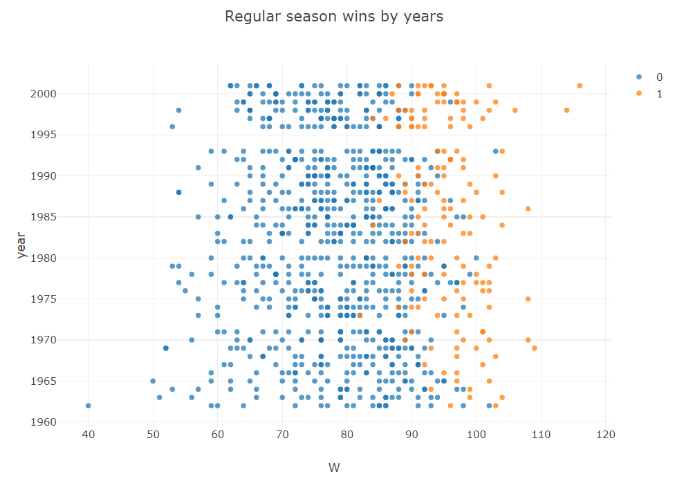

# 数据科学

> Tablesaw 提供了出色的功能，可以轻松高效地操作、可视化和探索来自各种来源的数据。对此的自然扩展是能够利用统计/机器学习方法以及此功能。 Tablesaw 现在支持与领先的 JVM 机器学习库 Smile 的基本集成。
> 
> Smile 支持多种机器学习技术，从基本的线性回归到无监督学习算法。该库在 JVM 领域以及与 Python/R 生态系统中的替代品相比都拥有一流的性能。
> 
> 在基础层面，可以使用 Tablesaw 完成项目所需的所有数据操作，然后在将表传递给模型时轻松地将其转换为 Smile DataFrame 格式。

## 1. 准备工作

Maven配置
```xml
<?xml version="1.0" encoding="UTF-8"?>
<project xmlns="http://maven.apache.org/POM/4.0.0"
         xmlns:xsi="http://www.w3.org/2001/XMLSchema-instance"
         xsi:schemaLocation="http://maven.apache.org/POM/4.0.0 http://maven.apache.org/xsd/maven-4.0.0.xsd">
    <modelVersion>4.0.0</modelVersion>

    <groupId>org.example</groupId>
    <artifactId>tablesaw-study</artifactId>
    <version>1.0-SNAPSHOT</version>

    <properties>
        <maven.compiler.source>11</maven.compiler.source>
        <maven.compiler.target>11</maven.compiler.target>
        <project.build.sourceEncoding>UTF-8</project.build.sourceEncoding>
    </properties>

    <dependencies>
        <dependency>
            <groupId>tech.tablesaw</groupId>
            <artifactId>tablesaw-core</artifactId>
            <version>0.43.1</version>
            <scope>compile</scope>
        </dependency>

        <dependency>
            <groupId>tech.tablesaw</groupId>
            <artifactId>tablesaw-jsplot</artifactId>
            <version>LATEST</version>
            <scope>compile</scope>
        </dependency>

        <dependency>
            <groupId>com.github.haifengl</groupId>
            <artifactId>smile-core</artifactId>
            <version>2.0.0</version>
        </dependency>
        
        <!-- https://mvnrepository.com/artifact/junit/junit -->
        <dependency>
            <groupId>junit</groupId>
            <artifactId>junit</artifactId>
            <version>4.13.2</version>
            <scope>test</scope>
        </dependency>


    </dependencies>

</project>
```

## 2. 案例一: 棒球比赛预测模型
> 线性回归分析被称为机器学习的“Hello World”，因为它应用广泛且易于理解。它也非常强大。我们将在这里使用 Smile 和 Tablesaw 完成建模过程。 Smile 是一个很棒的 Java 机器学习库，Tablesaw 是像 pandas 一样的数据整理库。

下面给出利用线性回归对棒球比赛的预测案例代码
```java
import org.junit.Test;
import smile.data.formula.Formula;
import smile.regression.LinearModel;
import smile.regression.OLS;
import tech.tablesaw.api.*;
import tech.tablesaw.columns.Column;
import tech.tablesaw.columns.numbers.NumberColumnFormatter;
import tech.tablesaw.plotly.Plot;
import tech.tablesaw.plotly.api.ScatterPlot;

import javax.swing.text.TabableView;

/**
 * ClassName: DataScienceTest
 * Package: PACKAGE_NAME
 * Description:
 *
 * @Author: Ning
 * @Create: 2023/1/5 - 0:47
 */
public class DataScienceTest {

    @Test
    public void regressionTest(){
        // 1. 导入数据
        Table baseball = Table.read().csv("src/test/resources/baseball.csv");

        // 2. 过滤数据，只选取2002年以前的
        Table moneyball = baseball.where(
                baseball.intColumn("year").isLessThan(2002)
        );

        // 3. 散点图可视化
        NumericColumn<?> wins = moneyball.nCol("W");
        NumericColumn<?> year = moneyball.nCol("Year");
        Column<?> playoffs = moneyball.column("Playoffs");

        Plot.show(
                ScatterPlot.create(
                        "Regular season wins by years",
                        moneyball,
                        "W",
                        "year",
                        "playoffs"
                )
        );

        // 4. 使用交叉表进行量化。交叉表计算属于不同组的观测值的数量或百分比。
        BooleanColumn ninetyFivePlus = BooleanColumn.create("95+ Wins", wins.isGreaterThanOrEqualTo(95), wins.size());
        moneyball.addColumns(ninetyFivePlus);
        Table xtab95 = moneyball.xTabColumnPercents("Playoffs", "95+ Wins");

        for(Object ea: xtab95.columnsOfType(ColumnType.DOUBLE)){
            ((NumberColumn)ea).setPrintFormatter(NumberColumnFormatter.percent(1));
        }

        NumberColumn RS = (NumberColumn) moneyball.numberColumn("RS");
        NumberColumn RA = (NumberColumn) moneyball.numberColumn("RA");

        NumberColumn runDifference = RS.subtract(RA).setName("RD");
        moneyball.addColumns(runDifference);

        Plot.show(
                ScatterPlot.create(
                        "Run Difference x Wins",
                        moneyball,
                        "RD",
                        "W"
                )
        );

        // 5. 使用OLS最小二乘法进行回归建模
        LinearModel winModel = OLS.fit(Formula.lhs("W"), moneyball.selectColumns("RD", "W").smile().toDataFrame());
        System.out.println(winModel);

        // 6. 预测
        double[] runDifferential = {135};
        double predict = winModel.predict(runDifferential);
        System.out.println(predict);
    }
}

```




模型内容
```java
Linear Model:

Residuals:
	       Min	        1Q	    Median	        3Q	       Max
	  -14.2662	   -2.6511	    0.1282	    2.9365	   11.6570

Coefficients:
                  Estimate Std. Error    t value   Pr(>|t|)
Intercept          80.8814     0.1312   616.6747     0.0000 ***
RD                  0.1058     0.0013    81.5536     0.0000 ***
---------------------------------------------------------------------
Significance codes:  0 '***' 0.001 '**' 0.01 '*' 0.05 '.' 0.1 ' ' 1

Residual standard error: 3.9391 on 900 degrees of freedom
Multiple R-squared: 0.8808,    Adjusted R-squared: 0.8807
F-statistic: 6650.9926 on 1 and 900 DF,  p-value: 0.000
```

预测结果
```java
95.15973375349623
```

## 3. 交叉表或列联表
> 如果您对观察结果出现在不同类别中的频率感兴趣，可以使用交叉制表，也称为列联表。 Tablesaw 支持一维和二维交叉表。

> *table.xTabCounts(colName1, colName2)*
> - 将table中的colName1列和colName2列绘制为交叉表。当然，也可以将一列绘制为交叉表。

示例
```java
import org.junit.Test;
import smile.data.formula.Formula;
import smile.regression.LinearModel;
import smile.regression.OLS;
import tech.tablesaw.api.*;
import tech.tablesaw.columns.Column;
import tech.tablesaw.columns.numbers.NumberColumnFormatter;
import tech.tablesaw.plotly.Plot;
import tech.tablesaw.plotly.api.ScatterPlot;

import javax.swing.text.TabableView;

/**
 * ClassName: DataScienceTest
 * Package: PACKAGE_NAME
 * Description:
 *
 * @Author: Ning
 * @Create: 2023/1/5 - 0:47
 */
public class DataScienceTest {

    @Test
    public void crossTableTest(){
        Table table = Table.read().csv("src/test/resources/bush.csv");
        StringColumn month = table.dateColumn("date").month();
        month.setName("month");
        table.addColumns(month);
        // 执行交叉表操作
        Table counts = table.xTabCounts("month", "who");
        System.out.println(counts.print());
    }
}

```

month 和 who两列制成的交叉表
```java
                              Crosstab Counts: month x who                              
 [labels]   |  fox  |  gallup  |  newsweek  |  time.cnn  |  upenn  |  zogby  |  total  |
----------------------------------------------------------------------------------------
     APRIL  |    6  |      10  |         3  |         1  |      0  |      3  |     23  |
    AUGUST  |    3  |       8  |         2  |         1  |      0  |      2  |     16  |
  DECEMBER  |    4  |       9  |         4  |         3  |      2  |      5  |     27  |
  FEBRUARY  |    7  |       9  |         4  |         4  |      1  |      4  |     29  |
   JANUARY  |    7  |      13  |         6  |         3  |      5  |      8  |     42  |
      JULY  |    6  |       9  |         4  |         3  |      0  |      4  |     26  |
      JUNE  |    6  |      11  |         1  |         1  |      0  |      4  |     23  |
     MARCH  |    5  |      12  |         4  |         3  |      0  |      6  |     30  |
       MAY  |    4  |       9  |         5  |         3  |      0  |      1  |     22  |
  NOVEMBER  |    4  |       9  |         6  |         3  |      1  |      1  |     24  |
   OCTOBER  |    7  |      10  |         8  |         2  |      1  |      3  |     31  |
 SEPTEMBER  |    5  |      10  |         8  |         3  |      0  |      4  |     30  |
     Total  |   64  |     119  |        55  |        30  |     10  |     45  |    323  |
```
>请注意右侧的总计列，其中显示在所有民意调查机构中，4 月份期间共进行了 23 次民意调查。同样，底部的列总数显示，fox进行了 64 次民意调查，gallup进行了 119 次，等等。

同时，我们还可以将统计数转换为百分比的形式。
> *table.xTablePercent(colName1,colName2)*

示例：
```java
import org.junit.Test;
import smile.data.formula.Formula;
import smile.regression.LinearModel;
import smile.regression.OLS;
import tech.tablesaw.api.*;
import tech.tablesaw.columns.Column;
import tech.tablesaw.columns.numbers.NumberColumnFormatter;
import tech.tablesaw.plotly.Plot;
import tech.tablesaw.plotly.api.ScatterPlot;

import javax.swing.text.TabableView;

/**
 * ClassName: DataScienceTest
 * Package: PACKAGE_NAME
 * Description:
 *
 * @Author: Ning
 * @Create: 2023/1/5 - 0:47
 */
public class DataScienceTest {

    @Test
    public void crossTableTest(){
        Table table = Table.read().csv("src/test/resources/bush.csv");
        StringColumn month = table.dateColumn("date").month();
        month.setName("month");
        table.addColumns(month);
        
        Table percents = table.xTabTablePercents("month", "who");
        percents
                .columnsOfType(ColumnType.DOUBLE)
                .forEach(
                        x->((NumberColumn) x).setPrintFormatter(NumberColumnFormatter.percent(1))
                );
        System.out.println(percents);
    }
    
}

```

```java
                               Crosstab Table Proportions:                                 
 [labels]   |   fox   |  gallup  |  newsweek  |  time.cnn  |  upenn  |  zogby  |  total   |
-------------------------------------------------------------------------------------------
     APRIL  |   1.9%  |    3.1%  |      0.9%  |      0.3%  |   0.0%  |   0.9%  |    7.1%  |
    AUGUST  |   0.9%  |    2.5%  |      0.6%  |      0.3%  |   0.0%  |   0.6%  |    5.0%  |
  DECEMBER  |   1.2%  |    2.8%  |      1.2%  |      0.9%  |   0.6%  |   1.5%  |    8.4%  |
  FEBRUARY  |   2.2%  |    2.8%  |      1.2%  |      1.2%  |   0.3%  |   1.2%  |    9.0%  |
   JANUARY  |   2.2%  |    4.0%  |      1.9%  |      0.9%  |   1.5%  |   2.5%  |   13.0%  |
      JULY  |   1.9%  |    2.8%  |      1.2%  |      0.9%  |   0.0%  |   1.2%  |    8.0%  |
      JUNE  |   1.9%  |    3.4%  |      0.3%  |      0.3%  |   0.0%  |   1.2%  |    7.1%  |
     MARCH  |   1.5%  |    3.7%  |      1.2%  |      0.9%  |   0.0%  |   1.9%  |    9.3%  |
       MAY  |   1.2%  |    2.8%  |      1.5%  |      0.9%  |   0.0%  |   0.3%  |    6.8%  |
  NOVEMBER  |   1.2%  |    2.8%  |      1.9%  |      0.9%  |   0.3%  |   0.3%  |    7.4%  |
   OCTOBER  |   2.2%  |    3.1%  |      2.5%  |      0.6%  |   0.3%  |   0.9%  |    9.6%  |
 SEPTEMBER  |   1.5%  |    3.1%  |      2.5%  |      0.9%  |   0.0%  |   1.2%  |    9.3%  |
     Total  |  19.8%  |   36.8%  |     17.0%  |      9.3%  |   3.1%  |  13.9%  |  100.0%  |
```

## 4. 案例二：使用K-Means聚类算法对纽约Uber公司的市场需求聚类分析
```java
import org.junit.Test;
import smile.clustering.KMeans;
import smile.data.formula.Formula;
import smile.regression.LinearModel;
import smile.regression.OLS;
import tech.tablesaw.api.*;
import tech.tablesaw.columns.Column;
import tech.tablesaw.columns.numbers.NumberColumnFormatter;
import tech.tablesaw.plotly.Plot;
import tech.tablesaw.plotly.api.LinePlot;
import tech.tablesaw.plotly.api.ScatterPlot;

import javax.swing.text.TabableView;
import java.time.LocalDateTime;
import java.time.format.DateTimeFormatter;
import java.util.List;

/**
 * ClassName: DataScienceTest
 * Package: PACKAGE_NAME
 * Description:
 *
 * @Author: Ning
 * @Create: 2023/1/5 - 0:47
 */
public class DataScienceTest {

    @Test
    public void kMeansTest(){
        Table pickups = Table.read().csv("src/test/resources/uber-pickups-apr14.csv");

        // 筛选 --- 删除lat大于40.91 小于40.50的数据（保留40.50到40.91的数据）
        pickups = pickups.dropWhere(
                pickups.doubleColumn("lat").isGreaterThan(40.91)
        );
        pickups = pickups.dropWhere(
                pickups.doubleColumn("lat").isLessThan(40.50)
        );
        // 筛选 --- 删除lon大于-73.8 小于-74.05的数据（保留-74.05到-73.8的数据）
        pickups = pickups.dropWhere(
                pickups.doubleColumn("lon").isGreaterThan(-73.8)
        );
        pickups = pickups.dropWhere(
                pickups.doubleColumn("lon").isLessThan(-74.05)
        );

//        System.out.println(pickups);

        // 随机选择10万条数据进行处理
        pickups = pickups.sampleN(100000);

        // 将 Date/time 列分为两个新列，一个LocalDateTimeColumn，一个localtime
        List<String> dateTimes = pickups.textColumn("Date/Time").asList();
        DateTimeColumn dateTimesAsLocalDateTime = DateTimeColumn.create("localDateTime");
        TimeColumn timeAsTimeColumn = TimeColumn.create("localTime");

        for(String dt: dateTimes){
            // 格式转换
            dateTimesAsLocalDateTime.append(
                    LocalDateTime.parse(dt, DateTimeFormatter.ofPattern("M/d/yyyy H:m"))
            );
            timeAsTimeColumn.append(
                    LocalDateTime.parse(dt,DateTimeFormatter.ofPattern("M/d/yyyy H:m")).toLocalTime()
            );
        }
        // 替换列
        pickups = pickups.replaceColumn("Date/Time", dateTimesAsLocalDateTime);
        // 添加列
        pickups.addColumns(timeAsTimeColumn);

//        System.out.println(pickups);

        // 使用KMeans进行聚类
        KMeans model = KMeans.fit(pickups.as().doubleMatrix(), 3);
        Table plot_data = pickups.copy();
        plot_data.addColumns(IntColumn.create("cluster", model.y));

        // 可视化
        Plot.show(
                ScatterPlot.create("K=3",plot_data,"lon","lat","cluster")
        );

        // 观察参数k与distortion的关系
        Table elbowTable = Table.create("Elbow", DoubleColumn.create("Distortion", 10));
        elbowTable.addColumns(IntColumn.create("k",10));

        for (int i = 2; i < 10; i++) {
            KMeans model2 = KMeans.fit(pickups.as().doubleMatrix(), i);
            elbowTable.doubleColumn("Distortion").set(i,model2.distortion);
            elbowTable.intColumn("K").set(i,i);
        }

        Plot.show(
                LinePlot.create("Distortion vs K",elbowTable,"k","distortion")
        );

    }
    
}

```


